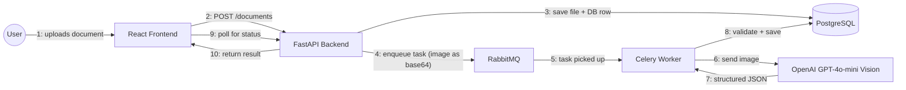

# AI Document Extraction

> An async document-processing system that extracts structured data from invoices and receipts using a Vision LLM.

[](https://www.python.org/)
[](https://fastapi.tiangolo.com/)
[](https://react.dev/)
[](https://www.postgresql.org/)
[](https://docs.celeryq.dev/)
[](https://www.docker.com/)

## Overview

A user uploads a document image (invoice, receipt, etc.). The backend queues it for async processing. A Celery worker sends the image directly to **OpenAI GPT-4o-mini Vision** — no traditional OCR — which returns structured data. The response is validated with **Pydantic**, stored in PostgreSQL, and the result, history, and stats are shown in the UI.

Inspired by [katanaml/sparrow](https://github.com/katanaml/sparrow), simplified to use a cloud LLM API + PostgreSQL.

This is the third and final project in a portfolio series:
1. [django-htmx-crud](https://github.com/Nurillo1997/django-htmx-crud) — Django + Oracle JET + HTMX
2. [image-task-queue](https://github.com/Nurillo1997/image-task-queue) — FastAPI + RabbitMQ + Celery (image processing)
3. **ai-document-extraction** (this repo) — FastAPI + Vision LLM + RabbitMQ + Celery

## Features

- JWT auth (signup/login), passwords hashed with bcrypt
- Drag-and-drop document upload
- Async processing via Celery + RabbitMQ — upload never blocks the UI
- OCR-free data extraction with OpenAI Vision
- Pydantic-validated structured output
- Live status polling, history with filters, and stats dashboard (Chart.js)
- Light/dark theme
- Fully Dockerized — identical setup for local dev and production

## Architecture



## Tech Stack

| Layer | Technology |
|---|---|
| Frontend | React, React Router, Tailwind CSS v4, Chart.js, Axios, Vite |
| Backend | FastAPI, SQLAlchemy, Alembic, Pydantic, python-jose (JWT) |
| Async processing | Celery, RabbitMQ |
| AI / LLM | OpenAI GPT-4o-mini (Vision, structured output) |
| Database | PostgreSQL |
| Infra | Docker, Docker Compose, nginx, Render.com |

## Project Structure

ai-document-extraction/

├── docker-compose.yml

├── backend/

│   ├── Dockerfile

│   └── app/

│       ├── core/        # config, database, celery, JWT

│       ├── models/      # User, Document, ExtractedField

│       ├── schemas/     # Pydantic schemas

│       ├── services/    # auth, vision_llm, celery tasks

│       └── routers/     # auth, documents

└── frontend/

├── Dockerfile

└── src/

├── api/         # axios client + requests

├── context/     # Auth, Theme

├── components/  # Navbar, ProtectedRoute, StatusBadge

└── pages/       # Signup, Login, Upload, Result, History, Stats

## Getting Started

### Docker Compose (recommended)

```bash
git clone https://github.com/Nurillo1997/ai-document-extraction.git
cd ai-document-extraction
cp backend/.env.example backend/.env
# fill in backend/.env — especially OPENAI_API_KEY

docker compose up --build
docker compose exec backend alembic upgrade head   # first run only
```

Open **http://localhost:5173**

### Local dev without Docker

```bash
# Terminal 1 — Backend
cd backend && source venv/bin/activate
uvicorn app.main:app --reload

# Terminal 2 — Celery Worker (macOS requires --pool=solo)
celery -A app.core.celery_app worker --loglevel=info --pool=solo

# Terminal 3 — Frontend
cd frontend && npm run dev
```

## Environment Variables

| Variable | Description |
|---|---|
| `DATABASE_URL` | PostgreSQL connection string |
| `JWT_SECRET_KEY` | Secret key for signing JWTs |
| `JWT_ALGORITHM` | JWT algorithm (`HS256`) |
| `JWT_EXPIRE_MINUTES` | Token expiry time |
| `CELERY_BROKER_URL` | RabbitMQ connection string |
| `OPENAI_API_KEY` | OpenAI API key (Vision LLM) |
| `VITE_API_BASE_URL` | Backend API URL for the frontend (build-time) |

## API Reference

| Method | Endpoint | Description | Auth |
|---|---|---|---|
| POST | `/auth/signup` | Register a new user | ❌ |
| POST | `/auth/login` | Log in, get JWT | ❌ |
| POST | `/documents` | Upload a document | ✅ |
| GET | `/documents` | List history (status filter) | ✅ |
| GET | `/documents/{id}` | Get extraction result | ✅ |
| GET | `/documents/{id}/file` | Get original uploaded file | ✅ |
| GET | `/documents/stats/summary` | Aggregate stats | ✅ |
| GET | `/health` | Health check | ❌ |

## Problems Solved

| # | Problem | Fix |
|---|---|---|
| 1 | `bcrypt` 5.x + `passlib` 1.7.4 conflict (SIGSEGV / attribute error) | Pinned `bcrypt==4.0.1` |
| 2 | macOS: Celery `prefork` pool + network I/O = SIGSEGV | `--pool=solo` for local dev; **confirmed unnecessary in Linux containers** — default `prefork` works fine in Docker and on Render |
| 3 | OpenAI `429 insufficient_quota` on fresh accounts | Set up billing |
| 4 | Celery worker ran as root inside the container (security risk) | Added a dedicated `appuser` in the Dockerfile, runs as non-root |
| 5 | Vite bakes `VITE_API_BASE_URL` in at build time, not runtime | Passed correctly via a Docker build arg |
| 6 | Production database (`documents_db`) didn't actually exist yet on the shared Render Postgres instance | Created it via `psql`, then ran `alembic upgrade head` directly against production |
| 7 | API and Celery Worker are separate Render services with no shared filesystem — the worker got `FileNotFoundError` trying to read files the API saved to its own local disk | The API now base64-encodes the image and passes it directly through the Celery task payload (via RabbitMQ), so the worker never touches local disk |

## Live Demo

- Frontend: https://ai-document-extraction-frontend.onrender.com
- API: https://ai-document-extraction-api.onrender.com

## Author

**Nurillo** — [GitHub](https://github.com/Nurillo1997)

